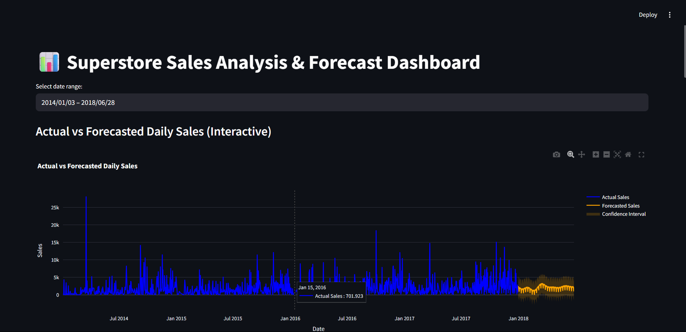
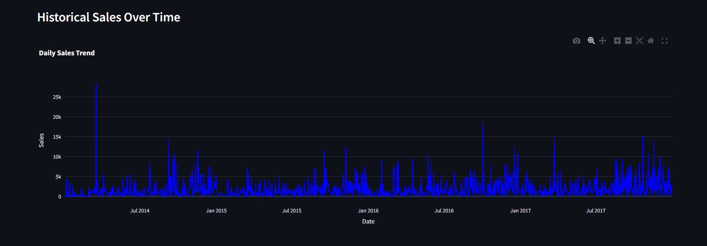
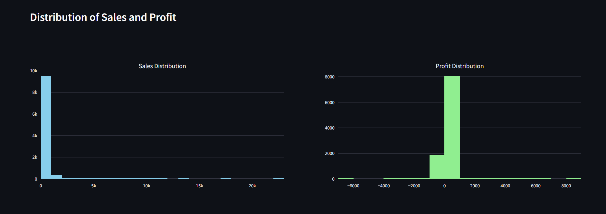
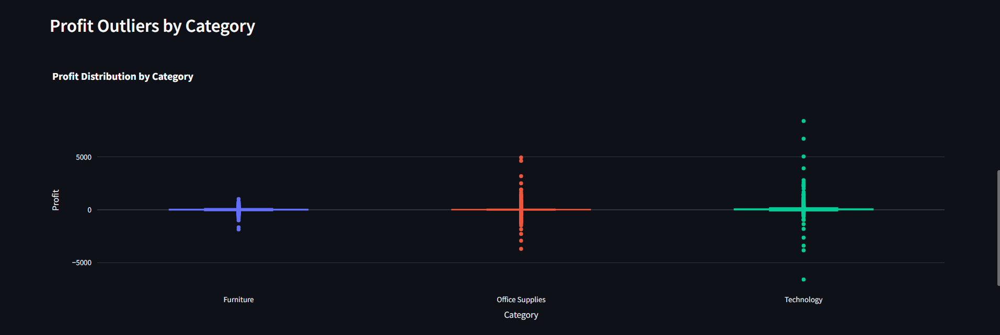
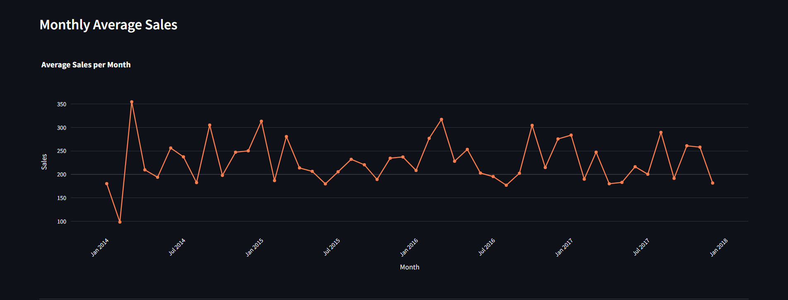

📊 Superstore Sales Forecast & Analysis Dashboard

An interactive dashboard built with Streamlit, Prophet and Plotly to visualize historical sales, detect trends & outliers, and forecast future daily sales for a retail superstore dataset.

---

✨ Features

✅ Forecast future sales using Prophet with holiday effects

✅ Visualize actual vs forecasted daily sales (with confidence interval)

✅ Interactive date range filter

✅ Explore distribution of sales & profit

✅ Analyze sales by category & sub‑category

✅ Detect profit outliers using boxplots

✅ View monthly average sales trend

✅ Clean, modern UI built with Streamlit & Plotly

---

🛠 Built With

- Python

- Streamlit

- Prophet (time series forecasting)

- Plotly & Plotly Express (interactive visualizations)

- Pandas

---

📦 Project Structure
```
├── app.py                  # Streamlit app
├── code.ipynb
├── daily_sales.csv         # Daily aggregated sales data
├── forecasted_sales.csv    # Prophet model forecast output
├── superstore_sales.csv    # Original raw dataset
└── README.md
```

---

📷 Screenshots / Visualizations

Here are some of the interactive charts & insights included in the dashboard:

Actual vs Forecasted Daily Sales



---

Historical Sales Trend



---

Sales & Profit Distribution



---

Profit Outliers by Category



---

Monthly Average Sales



---

